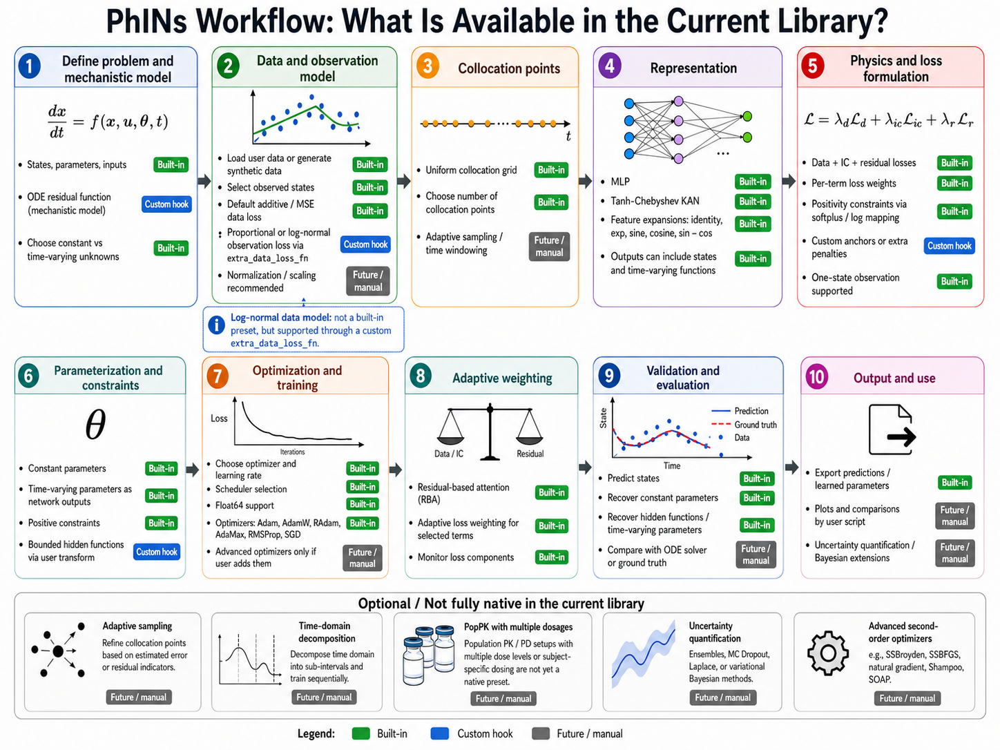

# PhINs: Pharmacometrics Informed Networks

<p align="center">
  
</p>

**PhINs** is a research library for **Physics-Informed Neural Networks (PINNs)** and **Physics-Informed KANs / PIKAN-style Chebyshev-KANs** for inverse problems, gray-box discovery, hidden mechanism recovery, and mechanistic learning from sparse or partially observed data.

It is designed for workflows that combine:

- observed data
- governing equations
- unknown constant parameters
- unknown time-varying parameters or functions
- interpretable mechanistic structure

PhINs is especially useful for:

- pharmacometrics
- PK / PD / QSP
- systems biology
- inverse ODE problems
- gray-box scientific machine learning

---

## Table of contents

- [What PhINs can do](#what-phins-can-do)
- [Package features](#package-features)
- [Installation](#installation)
- [Package structure](#package-structure)
- [How the library works](#how-the-library-works)
- [Quick start](#quick-start)
- [Defining data](#defining-data)
- [Defining the residual function](#defining-the-residual-function)
- [Feature expansion](#feature-expansion)
- [Architecture selection](#architecture-selection)
- [Constant and time-varying parameters](#constant-and-time-varying-parameters)
- [Partial observations](#partial-observations)
- [Constraints and bounded mappings](#constraints-and-bounded-mappings)
- [Loss weights](#loss-weights)
- [Residual-based attention](#residual-based-attention)
- [Adaptive loss weighting](#adaptive-loss-weighting)
- [Typical examples](#typical-examples)
- [Colab / Google Drive notes](#colab--google-drive-notes)
- [Current status](#current-status)
- [Citation / acknowledgement](#citation--acknowledgement)
- [Contributing](#contributing)

---

## What PhINs can do

PhINs supports the following modeling patterns.

### 1. Forward physics-informed learning

Use a neural network to solve a known governing equation.

### 2. Inverse parameter estimation

Estimate unknown constant parameters from data while enforcing the governing equations.

### 3. Time-varying parameter inference

Learn a time-varying rate, forcing, interaction term, or transfer coefficient as an additional network output.

### 4. Gray-box discovery

Learn an unknown term in the right-hand side of an ODE while keeping the known mechanistic structure fixed.

### 5. Partially observed systems

Fit data from only a subset of states while enforcing the full system dynamics through residual losses.

### 6. MLP vs KAN comparison

Solve the same problem with either a standard MLP or a Chebyshev-KAN / PIKAN-style architecture.

---

## Package features

### Architectures

The current core library supports:

- `mlp`
- `kan` — Chebyshev-KAN / PIKAN-style architecture

### Feature expansions

- `identity`
- `sin`
- `cos`
- `sincos`
- `exp`

### Parameter types

- constant parameters
- time-varying parameters

### Parameter constraints

- `none`
- `positive_softplus`
- `positive_exp`

### Data settings

- full-state observations
- initial-condition data
- collocation points for residuals
- custom extra data losses for partial observations

### Loss components

- data loss
- initial-condition loss
- residual loss
- named residual subterms
- extra custom losses

### Training options

- optimizer selection
- scheduler selection
- static user-defined loss weights
- optional residual-based attention, called RBA
- optional adaptive loss weighting across terms

---

## Installation

### Option 1: install from source

```bash
git clone <your-repo-url>
cd PhINs
pip install -e .
```

### Option 2: use locally without installation

```python
import sys
sys.path.append("/path/to/PhINs")
import phins
```

### Recommended Python packages

For the current core library, install:

```bash
pip install jax jaxlib optax numpy scipy matplotlib pandas
```

If your repository also contains extra research scripts or older experiments, you may also need:

```bash
pip install equinox jaxtyping lineax optimistix chex pyDOE tqdm
```

---

## Package structure

A typical layout is:

```text
phins/
├── __init__.py
├── config.py
├── constraints.py
├── data.py
├── features.py
├── models.py
├── optim.py
├── problem.py
└── trainer.py
```

### Main files

#### `config.py`

Contains configuration dataclasses:

- `FeatureConfig`
- `ArchitectureConfig`
- `ParameterSpec`
- `RBAConfig`
- `AdaptiveWeightConfig`
- `TrainingConfig`
- `DataConfig`
- `PINNConfig`

#### `features.py`

Implements feature expansion:

- raw identity input
- sine features
- cosine features
- sine/cosine features
- exponential features

#### `models.py`

Implements neural architectures:

- MLP
- Chebyshev-KAN / PIKAN-style KAN

#### `constraints.py`

Handles:

- splitting raw network outputs into states and time-varying parameters
- constant parameter transforms
- positivity constraints
- validation of time-varying parameter output indices

#### `problem.py`

Builds:

- data loss
- initial-condition loss
- residual terms
- optional extra losses
- context dictionaries for residual functions

#### `trainer.py`

Runs:

- optimization
- learning-rate schedules
- residual-based attention
- adaptive weighting
- prediction

---

## How the library works

The core workflow is:

```python
problem = PINNProblem(config, residual_fn, data_bundle)
trainer = PINNTrainer(problem)
result = trainer.fit()
pred = trainer.predict(t_test)
```

You provide:

1. a configuration object
2. a data bundle
3. a residual function

The library handles:

- network creation
- feature expansion
- automatic differentiation of states
- loss assembly
- optimization
- prediction

---

## Quick start

This minimal example fits a one-state ODE:

```python
import jax.numpy as jnp
from phins import (
    PINNConfig, FeatureConfig, ArchitectureConfig,
    TrainingConfig, DataConfig, ParameterSpec,
    PINNDataBundle, PINNProblem, PINNTrainer,
)

# --------------------------------------------------
# 1. Data
# --------------------------------------------------
t_data = jnp.linspace(0, 10, 21)[:, None]
y_data = jnp.zeros((21, 1))
t_ic = jnp.array([[0.0]])
y_ic = jnp.array([[0.0]])
t_col = jnp.linspace(0, 10, 100)[:, None]

bundle = PINNDataBundle(
    t_data=t_data,
    y_data=y_data,
    t_ic=t_ic,
    y_ic=y_ic,
    t_collocation=t_col,
)

# --------------------------------------------------
# 2. Residual function
# --------------------------------------------------
def residual_fn(ctx, t):
    x = ctx["states"]["x"]
    dx = ctx["state_grads"]["x"]
    a = ctx["constant_params"]["a"]

    return {
        "ode_x": dx + a * x,
    }

# --------------------------------------------------
# 3. Config
# --------------------------------------------------
cfg = PINNConfig(
    feature=FeatureConfig(kind="identity"),
    architecture=ArchitectureConfig(
        kind="mlp",
        hidden_layers=(64, 64, 64),
        activation="tanh",
    ),
    training=TrainingConfig(
        epochs=5000,
        learning_rate=1e-3,
        optimizer="adam",
        scheduler="cosine",
        scheduler_kwargs={"decay_steps": 5000},
        print_every=500,
        loss_weights={
            "data": 1.0,
            "ic": 1.0,
            "ode_x": 1.0,
            "residual": 0.0,
        },
    ),
    data=DataConfig(
        input_dim=1,
        state_names=["x"],
        parameter_specs=[
            ParameterSpec(
                name="a",
                mode="constant",
                constraint="positive_softplus",
                init_value=0.0,
            )
        ],
    ),
)

# --------------------------------------------------
# 4. Train
# --------------------------------------------------
problem = PINNProblem(cfg, residual_fn, bundle)
trainer = PINNTrainer(problem)
result = trainer.fit()

# --------------------------------------------------
# 5. Predict
# --------------------------------------------------
t_test = jnp.linspace(0, 10, 100)[:, None]
pred = trainer.predict(t_test)
x_pred = pred["states"]["x"]
```

---

## Defining data

The main data container is `PINNDataBundle`.

```python
PINNDataBundle(
    t_data=...,
    y_data=...,
    t_ic=...,
    y_ic=...,
    t_collocation=...,
)
```

### Meaning

- `t_data`: input/time points where observations are available
- `y_data`: observed values at those points
- `t_ic`: input/time points where initial conditions are enforced
- `y_ic`: initial-condition values
- `t_collocation`: collocation points used for physics residuals
- `metadata`: optional dictionary for extra user-defined information

### Shape convention

Usually:

```python
t_data.shape == (N, input_dim)
y_data.shape == (N, n_states_or_observed_outputs)
t_collocation.shape == (N_col, input_dim)
```

For standard ODE examples:

```python
t_data.shape == (N, 1)
y_data.shape == (N, n_states)
```

---

## Defining the residual function

The residual function has the form:

```python
def residual_fn(ctx, t):
    ...
    return {
        "name_of_residual_1": ...,
        "name_of_residual_2": ...,
    }
```

The context `ctx` contains the following fields.

### States

```python
ctx["states"]["C1"]
ctx["states"]["C2"]
```

### State derivatives

```python
ctx["state_grads"]["C1"]
ctx["state_grads"]["C2"]
```

### Constant parameters

```python
ctx["constant_params"]["k10"]
```

### Time-varying parameters

```python
ctx["time_varying_params"]["k12_tv"]
```

### All parameters

```python
ctx["all_params"]
```

### Data bundle

```python
ctx["data_bundle"]
```

Example:

```python
def residual_fn(ctx, t):
    C1 = ctx["states"]["C1"]
    C2 = ctx["states"]["C2"]

    dC1_dt = ctx["state_grads"]["C1"]
    dC2_dt = ctx["state_grads"]["C2"]

    k10 = ctx["constant_params"]["k10"]
    k21 = ctx["constant_params"]["k21"]
    k12 = ctx["time_varying_params"]["k12_tv"]

    return {
        "ode_C1": dC1_dt + (k10 + k12) * C1 - k21 * C2,
        "ode_C2": dC2_dt - k12 * C1 + k21 * C2,
    }
```

---

## Feature expansion

Feature expansion is configured through `FeatureConfig`.

### Identity

```python
FeatureConfig(kind="identity")
```

### Sine/cosine features

```python
FeatureConfig(
    kind="sincos",
    num_frequencies=3,
    input_scale=0.1,
    include_identity=True,
)
```

### Exponential features

```python
FeatureConfig(
    kind="exp",
    num_frequencies=2,
    input_scale=0.05,
    include_identity=True,
)
```

### What `include_identity=True` means

It keeps the original input in the feature vector. The network receives the original time/input plus the transformed features.

This is often safer and more expressive than using only transformed features.

---

## Architecture selection

Architecture is configured through `ArchitectureConfig`.

### MLP

```python
ArchitectureConfig(
    kind="mlp",
    hidden_layers=(64, 64, 64),
    activation="tanh",
)
```

### Chebyshev-KAN / PIKAN-style KAN

The current core library uses `kind="kan"` for the Chebyshev-KAN architecture.

```python
ArchitectureConfig(
    kind="kan",
    hidden_layers=(12, 12, 12),
    activation="tanh",
    chebyshev_degree=3,
)
```

### Recommendation

Start with `mlp`. Once the problem, residual, and loss weights are working, switch to `kan` for comparison.

---

## Constant and time-varying parameters

### Constant parameter

```python
ParameterSpec(
    name="k10",
    mode="constant",
    constraint="positive_softplus",
    init_value=0.0,
)
```

### Time-varying parameter

```python
ParameterSpec(
    name="k12_tv",
    mode="time_varying",
    constraint="none",
    output_index=2,
)
```

If states are:

```python
state_names=["C1", "C2"]
```

then:

```text
network output 0 -> C1
network output 1 -> C2
network output 2 -> k12_tv
```

Time-varying parameters must use output indices greater than or equal to the number of states.

---

## Partial observations

The built-in `data` loss compares all configured states against `y_data`. If you observe only part of the state vector, set the default `data` loss to zero and define a custom extra loss.

Example:

- model states: `C1`, `C2`
- observed data: only `C1`

```python
def extra_data_loss_fn(ctx, db):
    C1_pred = ctx["states"]["C1"]
    return {
        "data_C1": jnp.mean((C1_pred - db.y_data) ** 2),
    }
```

Then use:

```python
problem = PINNProblem(
    config=cfg,
    residual_fn=residual_fn,
    data_bundle=bundle,
    extra_data_loss_fn=extra_data_loss_fn,
)
```

and set:

```python
loss_weights={
    "data": 0.0,
    "data_C1": 1.0,
    "ic": 1.0,
    "ode_C1": 1.0,
    "ode_C2": 1.0,
    "residual": 0.0,
}
```

This is common in PK/PD/QSP examples where not every latent state is observed.

---

## Constraints and bounded mappings

PhINs supports simple constraints directly through `ParameterSpec`.

```python
constraint="none"
constraint="positive_softplus"
constraint="positive_exp"
```

For many inverse problems, a manual bounded mapping inside the residual is better.

Example: bounded time-varying `k12(t)` in a known range:

```python
import jax

def map_raw_to_k12(raw):
    k12_min = 0.05
    k12_max = 0.35
    return k12_min + (k12_max - k12_min) * jax.nn.sigmoid(raw)
```

Then inside the residual:

```python
k12_raw = ctx["time_varying_params"]["k12_tv"]
k12_t = map_raw_to_k12(k12_raw)
```

This is often more stable than learning the raw parameter directly.

---

## Loss weights

PhINs uses named loss terms.

Common names include:

- `data`
- `ic`
- `residual`
- residual names such as `ode_C1`, `ode_C2`
- custom losses such as `data_C1` or `fd0`

Example:

```python
loss_weights={
    "data": 0.0,
    "data_C1": 1.0,
    "ic": 1.0,
    "ode_C1": 10.0,
    "ode_C2": 10.0,
    "residual": 0.0,
}
```

### Important note about `residual`

The library creates both:

- individual residual terms, such as `ode_C1` and `ode_C2`
- an aggregate residual term called `residual`

If you already weight the individual residual terms, usually set:

```python
"residual": 0.0
```

Otherwise, residual losses may be counted twice.

---

## Residual-based attention

Residual-based attention, or RBA, applies adaptive pointwise weights inside residual terms.

```python
from phins import RBAConfig
```

Example:

```python
training=TrainingConfig(
    epochs=50000,
    learning_rate=1e-4,
    loss_weights={
        "data_C1": 1.0,
        "ode_C1": 10.0,
        "ode_C2": 10.0,
        "residual": 0.0,
    },
    rba=RBAConfig(
        enabled=True,
        target_terms=["ode_C1", "ode_C2"],
        lr_lambda=1e-2,
        gamma=0.999,
        lam_min=0.0,
        init_value=1.0,
        normalize_by_max=True,
    ),
)
```

### What RBA does

RBA reweights residual points according to their residual magnitude. This helps the model focus on regions where the physics residual is harder to satisfy.

### Best use

Use RBA for:

- ODE residual terms
- PDE residual terms
- stiff or localized residual errors

Do not usually use it for:

- data loss
- initial-condition loss
- anchor losses

---

## Adaptive loss weighting

Adaptive loss weighting rebalances scalar weights between different loss terms.

```python
from phins import AdaptiveWeightConfig
```

The current core implementation supports:

```python
method="inverse_loss"
```

Example:

```python
training=TrainingConfig(
    epochs=50000,
    learning_rate=1e-4,
    loss_weights={
        "data_C1": 1.0,
        "ode_C1": 10.0,
        "ode_C2": 10.0,
        "fd0": 10.0,
    },
    adaptive_weights=AdaptiveWeightConfig(
        enabled=True,
        target_terms=["data_C1", "ode_C1", "ode_C2", "fd0"],
        method="inverse_loss",
        update_every=100,
        gamma=0.9,
        eps=1e-8,
        init_value=1.0,
        normalize_sum_to=1.0,
    ),
)
```

### Difference between adaptive weighting and RBA

- Adaptive loss weighting rebalances between loss terms.
- RBA rebalances within a residual term, point by point.

They can be used separately or together.

---

## Typical examples

PhINs is suited for examples such as:

### Example 1: inverse ODE with unknown constants

Learn unknown rate parameters such as `kg` and `kb` in a compartment model.

### Example 2: gray-box unknown RHS function

Learn an unknown function `f(t)` appearing in one ODE equation.

### Example 3: PK/PD with time-varying transfer or absorption

Learn `k12(t)` or `ka(t)` while preserving mechanistic compartment structure.

### Example 4: hidden dynamic factor

Learn a hidden forcing or growth-modulation term such as `FD(t)`.

### Example 5: MLP vs KAN comparison

Solve the same inverse problem with both architectures.

---

## Colab / Google Drive notes

If using Google Colab, install packages first:

```bash
pip install jax jaxlib optax numpy scipy matplotlib pandas
```

### Prefer running from local `/content`

Google Drive is slower than local disk in Colab. A faster workflow is:

1. copy your repository from Drive to `/content`
2. run there
3. copy results back to Drive

Example:

```python
from google.colab import drive
drive.mount('/content/drive')

!cp -r /content/drive/MyDrive/PhINs /content/PhINs

import sys
sys.path.append('/content/PhINs')
```

Then:

```python
import phins
```

---

## Current status

PhINs is best described as a **research software library**:

- flexible
- easy to customize
- useful for inverse scientific ML
- especially good for ODE/PINN/gray-box experimentation

It is not intended to be a rigid black-box framework. It is designed for users who want to control:

- the residual
- the outputs
- the constraints
- the loss design
- the training strategy

---

## Practical advice

### Start simple

Before using:

- KAN
- exponential features
- residual-based attention
- adaptive loss weighting

first make sure the problem works with:

- MLP
- identity features
- moderate collocation count
- short training

### Good progression

1. MLP + identity
2. add bounded parameter mapping if needed
3. add `sincos` or `exp` features if needed
4. add RBA
5. add adaptive loss weighting
6. try KAN

---

## Citation / acknowledgement

If you use PhINs in your research, please cite the associated tutorial or methodological papers from this project when available.

---

## Contributing

Issues, example contributions, and pull requests are welcome, especially for:

- pharmacometrics
- systems biology
- gray-box scientific ML
- improved examples
- training-speed improvements

